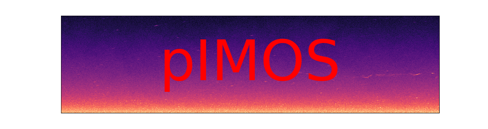
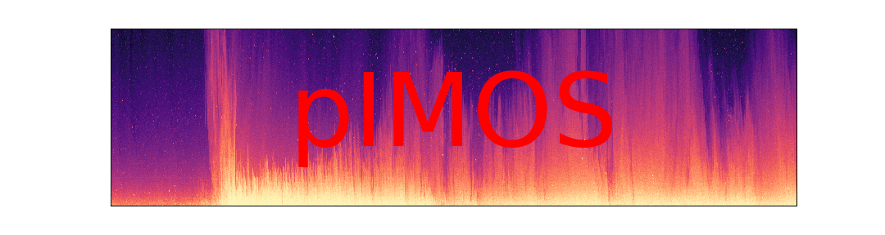

# pIMOS

UWA Ocean Dynamics focussed python coding of IMOS tools. Click here for the [IMOS Wiki](https://github.com/aodn/imos-toolbox/wiki). 

<!--  -->


The system consists of:

1. A Deployment Database
   1. IMOS database is in MS Access
   2. The pIMOS will be in postgreSQL. It will be inspired by the IMOS database, but no requirement for a matching API/structure.  
2. Instrument specific NetCDF templates that are 'as CF Compliant as possible'.
   1. Will only code instruments used by UWA Ocean Dynamics, not coding up all of the IMOS instruments [yet]
3. Parsers for each instrument file into compliant
   1. pIMOS contains a series of classes and superclasses which wrap xarray datasets and handle all of the conventions and metadata tracking
4. Pre-processing 
   1. IMOS call things like bin mapping and coordinate transforms ['pre-processing'](https://github.com/aodn/imos-toolbox/wiki/PPRoutines#coordinate-transformation-from-enu-to-beam-of-nortek-adcp-velocity-data---adcpnortekvelocityenu2beampp)
   2. This will all exist in pIMOS [so far as it is relevant to UWA instruments]. 
      1. The xarray Dataset wrapper will handle tracking of any pre-processing in the `Comments` global/variable attributes of the netCDF dataset.
      2. Ultimate goal to have the terminology and method nams as close to the IMOS terminology as possible.
5. Quality Control
   1. IMOS outlines many [QC procedures](https://github.com/aodn/imos-toolbox/wiki/QCProcedures)
   2. pIMOS will implement all that are relevant to UWA instruments. 
      1. The xarray Dataset wrapper will handle tracking of any QC in the `Comments` global/variable attributes of the netCDF dataset.
      2. Ultimate goal to have the terminology and method nams as close to the IMOS terminology as possible.

**Initial focus will be on moored instruments. Extend to profiling [Solander CTD and VMP] when time allows.

# Examples

General examples of processing files and the features of the package are found in the [Notebooks](notebooks) folder. 

Examples of archiving entire experiments are found in the [Experiments](experiments) folder, e.g.:

- The [KISSME Experiment](experiments/KISSME);
- Rowley Shoals 2019 still to come.  

## Database
- Hold metadata for:
    - Experiments
    - Field trips
    - Sites
    - Moorings
    - Deployment files [including URL]
    - UWA raw netcdf files [including URL]
    - UWA processed netcdf files [including URL]
    - LISST ** Not done yet
- Written in PostgreSQL [Code first database already written]
- Script to populate code first database from Matt Rayson's SQLLite database written also
- Still need to write tables for raw and processed netcdf data.

[Here](notebooks/postgreSQL_db_create.ipynb) is a draft notebook for generating a postgres database and adding some data. Ignore all the django stuff in that folder - that's another rabbit hole we don't need right now. 

## Python code
Code falls into 5 categories:
1. Raw file readers
1. The actual zutils.xrwrap object [common for ALL* instruments]
    - This class controls all the QAQC codes CF conventions etc. 
    - Each instrument will naturally inherit from this class, adding unique features if necessary
1. Code to parse from various data formats into the common data object
1. 'Pre-processing' code
1. QC code
1. External processing libraries

### 1. Raw file readers
Where possible, these should read from binary files and avoid complex dependencies or other human interference. Dependancies should be reduced where possible. If code is borrowed, acknowledge it. Dependence on Dolfyn for exmple is not ideal as Kilcher is always changing his API, but the author must be acknowledged.

- SBE56 [Done using UHDAS code]
- SBE39 [Done using UHDAS code]
- SBE37 [Done using UHDAS code]
- RDI ADCP [Done with Dolfyn]
- Vector [Done with Dolfyn and Dall's Porpoise]
  - Dall's Porpoise is itself just a rip off of Dolfyn but handles some corrupt VEC files
- Signature [Done with Dolfyn]
- WetlabsNTU [reads .raw files with pandas]

** Profiling instruments [CTD/VMP] are only partially done, and will be the lowest priority. These will be added once the rest of the system is complete

### 2/3. Parse into xrwrap object
[Here](notebooks/xarray_wrapper_intro.ipynb) is a basic intro to the xarray wrapper and how to interface with the underlying NetCDF file.

Instrument specific examples are covered in the following notebooks:

- [SBE56 T, SBE39 TP, SBE39 T, SBE37 CTD, SBE37 CT](./notebooks/xarray_wrapper_Seabird_37_39_and_56.ipynb)
- [RDI ADCP](./notebooks/xarray_wrapper_RDI_LONGRANGER_ADCP.ipynb)
- [Nortek Vector](./notebooks/xarray_wrapper_Nortek_Vector.ipynb)
- [Nortek Signature](./notebooks/Nortek_Signature.ipynb)
- [WetLABS NTU](./notebooks/xarray_wrapper_WetlabsNTU.ipynb)
- LISST

Only the Seabird example runs through every file [for KISSME] on a loop. The others are just individual examples. 

### 4/5. Preprocessing/QC code
To the extent that this exists it is all in those notebooks above. We have:
- Despiking [Goring Nikora]
- Phase unwrapping
- Bin Mapping
- ADV and ADCP coordinate transforms
- Acoustic instrument QAQC [incomplete]

Down the line we should add:

- Ocean mooring code for vertically concatenating a thermistor string of multiple CTDs

- Motion correction
- More auto QC routines with IMOS style names

** NOTE. A point where we may differ from IMOS. We will often 'replace' data removed in QC, rather than just flagging it. Need to think how this is handled. Maybe we should have a

1. 'modified' flag, or;
2. Just add the comment to the nc that the change was made, but not actually flag exactly which variables were changed. 

## 6. External processing code

Other repos exist for actual calculations, and these will be appropriately linked to this repo with examples.
- mrayson/sfoda
    - Signal processing/filtering/harmonic analysis
    - Modal decomposition
- mrayson/mycurrents
    - stacking ocean mooring
    - xarray visualisation
- iosonobert/turbo_tools
    - Turbulence calcs
        - IDM dissipation
        - Variance method
        - Structure function method
    - Turbulence QC
        - Phase unwrapping
        - Goring Nikora
- iosonobert/microstructure
- iosonobert/bert_ms_private
- Whitwell git hub?
    - Motion correction?
    - Wavelet stuff?

# Process Levels

Another thing IMOS defines are [Process(ing) Levels](https://github.com/aodn/imos-toolbox/wiki/ProcessLevelsAndQC). In a nutshell, this is how much processing has been performed, and the levels are:

- FV00 Raw Data
  - Raw data is defined as unprocessed data and data products that have not undergone quality control. The data may be in engineering units or physical units, time and locations details can be in relative units and values can be pre-calibration measurements. Level 0 data is not suitable for public access within IMOS.
- FV01 Quality Controlled Data
  - Quality controlled data have passed quality assurance procedures such as automated routines and sensor calibration or visual inspection and removal of obvious errors. The data are in physical units using standard SI metric units with calibration and other pre-processing routines applied, all time and location values are in absolute coordinates to comply with standards and datum. Data includes flags for each measurement to indicate the estimated quality of the measurement. Metadata exists for the data or for the higher level dataset that the data belongs to. This is the standard IMOS data level and is what should be made available to AODN and to the IMOS community.
- FV02 Derived Products
  - Derived products require scientific and technical interpretation. Normally these will be defined by the community that collects or utilises the data.
- FV03 Interpreted Products
  - These products require researcher driven analysis and interpretation, model based interpretation using other data and / or strong prior assumptions.
- FV04 Knowledge Products
  - These products require researcher driven scientific interpretation and multidisciplinary data integration and include model-based interpretation using other data and / or strong prior assumptions.

We must decide:

1. Whether we agree with these designations for our purposes [e.g. I'm not sure how you can call something QCd until there has been some attempt to interpret it]
2. How far I'm personally intended to take this archiving
3. What to do, going forward, with everyone's Derived & Interpreted Products.

# Dependencies

Current state of play:

- netcdf4

- xarray
- Dolfyn [for now]
- Dall's Porpoise [needed for reading corrupt .VEC files, otherwise can just use Dolfyn for everything] 
- zutils [for convenience for now, anything here can be moved to pIMOS.utils]
- psycopg2 [for connecting to postgres database]
- windrose [this is not a good dependency, amend this]
- jupyter [not really a dependency but the examples use jupyter to help render in github]

# Testing

## Install smoke test [implemented]

The repo now includes an install smoke test that validates packaging and dependency resolution in a clean temporary virtual environment.

What it does:

1. Creates a temporary virtual environment.
2. Installs the package from the local source tree with `pip install .`.
3. Runs `pip check`.
4. Verifies direct dependencies declared in `pyproject.toml` are present.
5. Checks installed package metadata/module discovery.
6. Deletes the temporary environment on exit.

Run it with:

```bash
pytest -m install -q
```

This test is implemented in `tests/test_install_smoke.py`.

## Runtime smoke tests [implemented]

Runtime smoke tests are implemented as a second test layer.

Purpose:

- Install smoke tests validate packaging/dependency resolution.
- Runtime smoke tests validate that key imports and basic workflows actually execute.

Why this is separate:

- Top-level imports can pull a large dependency chain.
- A package can install correctly but still fail at runtime due to transitive import or API compatibility issues.

Runtime markers and usage:

```bash
pytest -m runtime -q
```

This test is implemented in `tests/test_runtime_venv_smoke.py`.
It creates a fresh temporary virtual environment, installs `pIMOS` from the local source tree, and runs runtime loader checks inside that clean environment.

The current runtime loader checks are implemented in `tests/test_netcdf_class_loader.py`.

You can run those loader checks directly in your current environment with:

```bash
pytest -q tests/test_netcdf_class_loader.py
```

Current runtime checks:

1. Validate class-level `from_netcdf` loaders using synthetic NetCDF test data.
2. Validate module-level `from_netcdf` entry points route correctly to class-level loaders.
3. Run these checks inside a freshly created virtual environment.

Suggested CI usage:

1. Run `-m install` on broad interpreter matrix.
2. Run `-m runtime` on known-supported interpreter/dependency combinations.

# Versioning

Versioning is managed automatically via [`setuptools_scm`](https://github.com/pypa/setuptools_scm), which derives the package version from Git tags.

## How it works

- The file `pIMOS/_version.py` is **auto-generated** at install time. Do not edit it manually and do not commit it (it is listed in `.gitignore`).
- When the working tree is exactly at a release tag (e.g. `v1.2.1`), the package reports `1.2.1`.
- When there are commits after a tag, the version becomes a `dev` string, e.g. `1.2.2.dev3+gabcdef`.
- If no Git metadata is available at all (e.g. a source tarball), `fallback_version = "1.1.2"` is used (set in `pyproject.toml`).

## Checking the current version

```python
import pIMOS
print(pIMOS.__version__)
```

Or from the command line:

```bash
python -c "import pIMOS; print(pIMOS.__version__)"
```

## Making a release (collaborators)

1. Commit everything and push to `master`:
   ```bash
   git push
   ```
2. Create an annotated tag on the commit you want to release:
   ```bash
   git tag -a v1.3.0 -m "Release v1.3.0"
   ```
3. Push the tag to GitHub:
   ```bash
   git push origin v1.3.0
   ```
4. Reinstall locally to regenerate `_version.py` from the new tag:
   ```bash
   pip install -e .
   python -c "import pIMOS; print(pIMOS.__version__)"   # should print 1.3.0
   ```
   > **Note:** The editable install (`-e`) makes source code changes immediately available on import, but `_version.py` is only written by setuptools_scm at install time — it does not re-query git on every import. So you must re-run `pip install -e .` after creating a new tag for the version to update.

If you need to build a distribution for PyPI:
```bash
pip install build
python -m build
# uploads dist/*.whl and dist/*.tar.gz to PyPI
```

The built artifact will carry the exact version string from the tag.

# Known Issues

Making a list here rather than using the issues register in case I need to kill this repo and recreate. 

- Database

  - Incomplete

- Instrument readers

  - RDI ADCP

    - Only really handles BEAM coordinates
    - Doesn't yet save all of the instrument config

  - Signature

    - Only handles BEAM coordinates
    - Doesn't yet save all of the instrument config
    - Not yet on xrwrap

  - Vector

    - Doesn't handle corrupt IMU files. Nobody has written this code. 
    - Only handles XYZ coordinates

  - Seabird 56

    - Time not reading correctly

  - Microstructure

    - Python translation of ODAS needs thorough testing
      - Is there a PhD student that can do this?
      - If not Whitwell and I will pump it out

    

- CF conventions

  - Can always put more time into this

- QC

  - Not all IMOS procedures coded
  - Not following IMOS names
  - 

